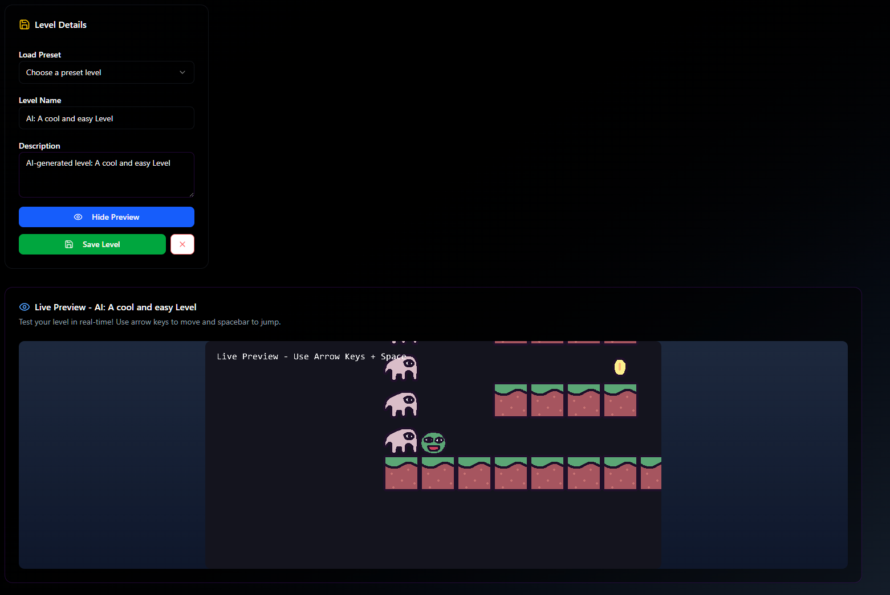

# 🎮 HashJump

<div align="center">
  
  
  **The Future of Hyper-Casual Gaming on Blockchain**
  
  [](https://nextjs.org/)
  [](https://soliditylang.org/)
  [](LICENSE)
  
</div>

---

## 🌟 Overview

HashJump is a revolutionary blockchain-based gaming platform where users can create, play, and earn from hyper-casual platformer games. Built with fairness, transparency, and decentralization at its core, HashJump empowers both game creators and players to participate in a new gaming economy.

### ✨ Key Features

- 🎨 **No-Code Game Creator**: Build platformer games with an intuitive visual editor
- 🔗 **Blockchain Integration**: Games deployed as smart contracts with real rewards
- 🎯 **Practice Mode**: Master skills with free practice levels before competing
- 💰 **Real Prizes**: Compete for HBAR tokens in blockchain-deployed games
- 🏆 **Leaderboards**: Track top players and compete for rankings
- 🎮 **Play-to-Earn**: Fair revenue distribution (50% pool, 20% creator, 20% platform)
- 🔐 **Wallet Integration**: Secure MetaMask and Hedera wallet support

---

## 🚀 Tech Stack

### Frontend
- **Framework**: Next.js 14 (React 18)
- **Language**: TypeScript
- **Styling**: Tailwind CSS
- **UI Components**: shadcn/ui
- **Game Engine**: Kaboom.js
- **State Management**: React Hooks

### Blockchain
- **Smart Contracts**: Solidity 0.8.0
- **Blockchain**: Hedera Hashgraph (HBAR)
- **Web3 Library**: ethers.js v6
- **Contract Optimization**: Hardhat with optimizer enabled

### Backend
- **API Routes**: Next.js API Routes
- **AI Integration**: OpenAI GPT (for level generation)

---

## 📦 Installation

### Prerequisites

- Node.js 18+ and npm
- MetaMask or Hedera wallet
- Git

### Setup Instructions

1. **Clone the repository**
   ```bash
   git clone https://github.com/yourusername/hashjump.git
   cd hashjump
   ```

2. **Install dependencies**
   ```bash
   npm install
   ```

3. **Configure environment variables**
   
   Create a `.env.local` file in the root directory:
   ```env
   # OpenAI API Key (for AI level generation)
   OPENAI_API_KEY=your_openai_api_key_here
   
   # Smart Contract Configuration
   NEXT_PUBLIC_GAME_FACTORY_ADDRESS=0xYourContractAddress
   
   # Optional: Deployment Keys
   PRIVATE_KEY=your_wallet_private_key
   HEDERA_RPC_URL=your_rpc_url
   ```

4. **Run the development server**
   ```bash
   npm run dev
   ```

5. **Open your browser**
   
   Navigate to [http://localhost:3000](http://localhost:3000)

---

## 🎮 How to Use

### For Players

1. **Connect Your Wallet**
   - Click "Connect Wallet" in the header
   - Approve the connection in MetaMask/Hedera wallet

2. **Choose Your Mode**
   - **Practice Mode**: Free games to learn mechanics
   - **Blockchain Games**: Compete for real HBAR rewards

3. **Play & Earn**
   - Pay the entry fee (for blockchain games)
   - Complete levels to win prize pools
   - Earn tokens based on performance

### For Game Creators

1. **Navigate to Create Page**
   - Click "Create Game" from the homepage

2. **Design Your Game**
   - Use the visual editor to place platforms, obstacles, and collectibles
   - Add multiple levels with increasing difficulty
   - Set game parameters (cost, prize pool)

3. **Deploy to Blockchain**
   - Review your game settings
   - Pay deployment fee (gas)
   - Share your game address with players

---

## 🏗️ Project Structure
```bash
HashJump/
├── src/
│   ├── app/
│   │   ├── page.tsx                 # Homepage
│   │   ├── play/page.tsx           # Game browser
│   │   ├── create/page.tsx         # Game creator
│   │   ├── game/[gamekey]/         # Play game
│   │   └── api/
│   │       ├── generate-map/       # AI level generation
│   │       └── publish-game/       # Blockchain deployment
│   ├── lib/
│   │   ├── smartContract.ts        # Blockchain integration
│   │   └── wallet.ts              # Wallet connection
│   └── components/
│       └── ui/                     # shadcn/ui components
├── SmartContracts/
│   ├── GameFactory.sol             # Original factory (deprecated)
│   ├── GameFactoryMinimal.sol      # Optimized factory
│   ├── Game.sol                    # Individual game contract
│   └── GameMath.sol               # Revenue calculation library
├── public/
│   ├── sprites/                    # Game assets
│   └── data/
│       └── levels.json            # Level templates
└── package.json
```
### GameFactoryMinimal

The optimized factory contract for creating and managing games.

**Key Features:**
- ✅ Size-optimized (<24,576 bytes)
- ✅ Gas-efficient deployment
- ✅ Immutable constants for better optimization
- ✅ Consolidated functions

**Main Functions:**
```solidity
// Create a new game
function createGame(string memory gameName, uint256 costOfPlay)

// Create game with levels
function createGameWithLevels(
    string memory gameName,
    string[][] memory levels,
    uint256 costOfPlay
)

// Get game information
function getGameInfo(uint256 gameId)

// Get revenue breakdown
function getRevenueBreakdown(uint256 amount)
```

### Game Contract

Individual game contract managing gameplay and rewards.

**Revenue Distribution:**
- 50% → Prize Pool
- 20% → Game Creator
- 20% → Platform
- 10% → Reserved

---

## 🔧 Configuration

### Update Smart Contract Address

Edit `src/lib/smartContract.ts`:
```typescript
const GAME_FACTORY_ADDRESS = '0xYourDeployedContractAddress';
```

### Customize Game Settings

Edit level data in `public/data/levels.json` or use the visual editor.

---

## 🚢 Deployment

### Frontend Deployment (Vercel)

1. **Push to GitHub**
   ```bash
   git push origin main
   ```

2. **Connect to Vercel**
   - Import your repository on [Vercel](https://vercel.com)
   - Add environment variables
   - Deploy

### Smart Contract Deployment

1. **Compile contracts**
   ```bash
   cd SmartContracts
   npx hardhat compile
   ```

2. **Deploy to network**
   ```bash
   npx hardhat run scripts/deploy-optimized.js --network hedera-testnet
   ```

3. **Verify contract**
   ```bash
   npx hardhat verify --network hedera-testnet DEPLOYED_CONTRACT_ADDRESS
   ```

---

## 🎯 Roadmap

### Phase 1: MVP ✅
- [x] Basic game engine
- [x] Smart contract integration
- [x] Wallet connection
- [x] Game creator tool

### Phase 2: Enhancement 🚧
- [x] AI-powered level generation
- [x] Optimized smart contracts
- [x] Practice mode
- [ ] Multiplayer support

### Phase 3: Expansion 📋
- [ ] NFT integration for game assets
- [ ] Tournament system
- [ ] Mobile app
- [ ] Cross-chain support
- [ ] DAO governance

---

## 🤝 Contributing

We welcome contributions! Please follow these steps:

1. **Fork the repository**
2. **Create a feature branch**
   ```bash
   git checkout -b feature/amazing-feature
   ```
3. **Commit your changes**
   ```bash
   git commit -m 'Add amazing feature'
   ```
4. **Push to the branch**
   ```bash
   git push origin feature/amazing-feature
   ```
5. **Open a Pull Request**

### Development Guidelines

- Follow TypeScript best practices
- Write clean, commented code
- Test thoroughly before submitting
- Update documentation as needed

---

## 🐛 Known Issues & Solutions

### Contract Size Issues
If you encounter contract size limits (>24,576 bytes):
- Use `GameFactoryMinimal.sol` instead of `GameFactory.sol`
- Enable Solidity optimizer with runs=200
- Store large data off-chain (IPFS)

### Wallet Connection Issues
- Ensure MetaMask is installed and unlocked
- Check network configuration (Hedera testnet)
- Clear browser cache if issues persist

### Gas Estimation Errors
- Increase gas limit in wallet settings
- Ensure sufficient HBAR balance
- Retry after network congestion reduces

---

## 📊 Hedera Smart Contract

[Game Factory Smart Contract](https://hashscan.io/testnet/contract/0.0.7130167)


#### **GameFactoryMinimal**
Factory contract for creating and managing game instances across the platform.

**Purpose:**
- Deploys individual Game contracts
- Tracks all games by ID and owner
- Provides game discovery and verification
- Manages platform-wide statistics

**Key Functions:**
- `createGame()` - Deploy new game with custom parameters
- `createGameWithLevels()` - Deploy game with pre-loaded level data
- `getGameInfo()` - Retrieve comprehensive game metadata
- `getGamesByOwner()` - Query games by creator address
- `verifyGame()` - Confirm contract authenticity

**Optimization:**
- Size: ~18,000 bytes (47% smaller than original)
- Gas-optimized with immutable constants
- Uses library pattern to reduce bytecode duplication

---

#### **Game Contracts**
Individual smart contracts for each game, managing state and economics.

**Purpose:**
- Store game levels and configuration
- Handle player entry fees in HBAR
- Manage prize pool accumulation
- Distribute rewards automatically
- Track player statistics

**Key Functions:**
- `playGame()` - Process player entry and payment
- `awardPrize()` - Distribute winnings to victorious players
- `addLevel()` - Add new level data to the game
- `getPaymentInfo()` - View prize pool and player count
- `updateCostOfPlay()` - Creator can adjust entry fee


#### **GameMath Library**
Shared calculation library for consistent revenue splits.

**Purpose:**
- Reusable revenue calculation functions
- Ensures consistent math across all contracts
- Reduces bytecode duplication
- Gas-efficient operations

**Functions:**
- `getRevenueBreakdown()` - Calculate 50/20/20/10 split
- `calculatePoolShare()` - Compute prize pool portion
- `calculateCreatorShare()` - Compute creator earnings
- `calculatePlatformShare()` - Compute platform fees

**Benefits:**
- Single source of truth for economics
- Easy to audit and verify
- Reduces deployment costs
---

## 🙏 Acknowledgments

- **Hedera** - For blockchain infrastructure
- **Kaboom.js** - For the game engine
- **OpenAI** - For AI-powered level generation
- **shadcn/ui** - For beautiful UI components
- **Vercel** - For hosting and deployment

---

## 🎨 Screenshots

### Homepage


### Game Creator


### Gameplay


### Gamers


---

<div align="center">
  <p>Built with ❤️ by the HashJump Team</p>
</div>